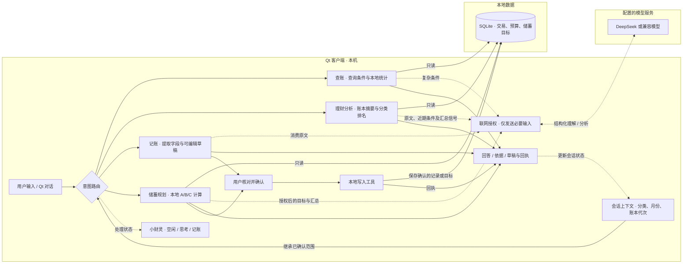

# 小财灵 Agent 架构

```mermaid
flowchart LR
  subgraph desktop["Qt 客户端 · 本机"]
    entry["用户输入 / Qt 对话"]
    context["会话上下文 · 分类、月份、账本代次"]
    route{"意图路由"}
    query["查账 · 查询条件与本地统计"]
    advice["理财分析 · 账本摘要与分类排名"]
    draft["记账 · 提取字段与可编辑草稿"]
    plan["储蓄规划 · 本地 A/B/C 计算"]
    auth["联网授权 · 仅发送必要输入"]
    confirm["用户核对并确认"]
    write["本地写入工具"]
    output["回答 / 依据 / 草稿与回执"]
    mascot["小财灵 · 空闲 / 思考 / 记账"]
  end
  subgraph storage["本地数据"]
    ledger[("SQLite · 交易、预算、储蓄目标")]
  end
  subgraph online["配置的模型服务"]
    model["DeepSeek 或兼容模型"]
  end
  entry --> route
  context -->|"继承已确认范围"| route
  route --> query
  route --> advice
  route --> draft
  route --> plan
  route -.->|"处理状态"| mascot
  query -->|"只读"| ledger
  advice -->|"只读"| ledger
  plan -->|"只读"| ledger
  query -.->|"复杂条件"| auth
  advice -.->|"原文、近期条件及汇总信号"| auth
  draft -.->|"消费原文"| auth
  plan -.->|"授权后的目标与汇总"| auth
  auth <-.->|"结构化理解 / 分析"| model
  query --> output
  advice --> output
  draft --> output
  plan --> output
  draft --> confirm
  plan --> confirm
  confirm --> write
  write -->|"保存确认的记录或目标"| ledger
  write -->|"回执"| output
  output -.->|"更新会话状态"| context
```
